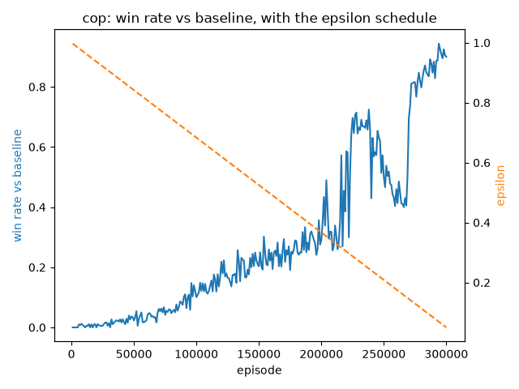
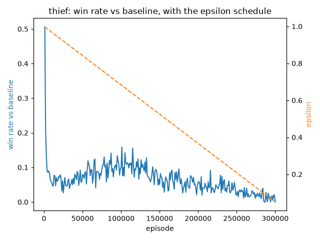
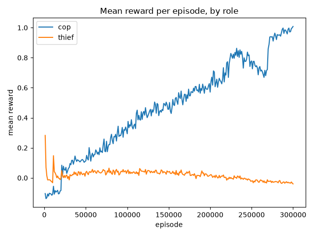

# P2P Cops-and-Robbers — Cop & Thief Agents

Two autonomous AI agents — a **cop** and a **thief** — that play a distributed
cops-and-robbers match on a 7×7 grid over a peer-to-peer network with **no central server
and no referee**. Final project for *Orchestration of AI Agents* (University of Haifa).
Each agent is a symmetric [FastMCP](https://gofastmcp.com) peer (server + client) that
decides moves with a trained tabular **Q-learning** policy (Bayes + BFS fallback),
communicates through deceptive natural-language hints and a decaying scent trail, and
proves honesty via SHA-256 commit-reveal — then competes in a league against other teams'
agents.

## Status

Built in 8 phases, mirroring the book's build order (§10.3). See
[docs/TODO.md](docs/TODO.md) and [.planning/ROADMAP.md](.planning/ROADMAP.md) for the
live phase-by-phase status.

| Phase | What it delivers |
|---|---|
| 1 | Base game logic — grid, movement, barrier quota, capture |
| 2 | FastMCP P2P infrastructure — two processes, localhost |
| 3 | Strategy module (Q-learning policy), playing blind *(in progress — this README's [Learning Curves](#learning-curves-phase-3-rule-42) section)* |
| 4 | Language & scent — hints, pheromones, deception |
| 5 | Cloud exposure and tunneling |
| 6 | Security — commit-reveal, nonce, Step-0 |
| 7 | Reporting shell — Gmail API, live GUI, replay viewer |
| 8 | Submission — two cross-linked repos, tag, league games |

## Documentation

- [docs/RULES.md](docs/RULES.md) / [docs/PARAMETERS.md](docs/PARAMETERS.md) — the game/protocol
  rules and every numeric game value (both extracted from the book, `police_thief_p2p.pdf`)
- [docs/SEGAL_GUIDELINES.md](docs/SEGAL_GUIDELINES.md) — the engineering standard this repo is
  graded against
- [docs/PRD.md](docs/PRD.md) · [docs/PLAN.md](docs/PLAN.md) · [docs/TODO.md](docs/TODO.md) —
  project-level requirements/design/task tracking
- [docs/PRD_rl_strategy.md](docs/PRD_rl_strategy.md) — the Phase-3 Q-learning mechanism contract
  (state encoding, reward, update rule, fallback, training regime, evaluation bar)
- [docs/phases/](docs/phases/) — per-phase PRD/PLAN/TODO triplets

## Development

```bash
uv sync                          # install dependencies (uv only — see CLAUDE.md)
uv run pytest --cov=pursuit --cov=training   # tests + coverage (>= 85%)
uv run ruff check .              # lint (0 violations required)
bash scripts/check_line_limit.sh # every source/test file <= 150 code lines
```

Copy `.env-example` to `.env` and fill in real values before running anything that reads
secrets (`os.environ.get()` only — never hardcoded, per project rule 4).

## Learning Curves (Phase 3, rule 42)

Rule 42 makes learning curves a mandatory, graded README section. `training/curves.py`
appends one row per role (`episode, epsilon, alpha, mean_reward, winrate_vs_baseline,
fallback_rate, role`) from **episode 1 of run 1** — instrumentation is not retrofitted onto
an already-running job (D-16). `training/plot_curves.py` renders the PNGs below and computes
the E6 convergence verdict; run it yourself with:

```bash
uv run python training/plot_curves.py <artifacts_dir>/curves.csv <outdir>
```

Cop and thief are always plotted and judged **separately**, never averaged into one line or
one verdict — averaging would hide one role converging while the other stays random (D-25).

### Evaluation bar (configured, `config/police/strategy.json` / `config/thief/strategy.json`)

| Quantity | Configured value | Meaning |
|---|---|---|
| `win_rate_margin` | 0.10 | Q-policy must beat `HeuristicBrain` by at least this margin (E5), and the final-decile mean win-rate must exceed the first-decile mean by at least this margin (E6) |
| `min_win_rate_absolute` | 0.55 | Absolute win-rate floor, guards against a trivially weak baseline (E5) |
| `eval_games` | 200 per arm, per role | 20 scenarios × 10 seeds each ([docs/phases/phase-3](docs/phases/phase-3/)) |
| `convergence_window` / `convergence_tolerance` | 20000 episodes / 0.02 | The trailing win-rate drift must fall within this bound for the curve to count as flattened (E6) |
| `episodes` | 300000 | Overnight training run length |
| `seed` | 1337 | Logged with every run for reproducibility (training and eval both) |

### Run 1 — 300,000 episodes (measured, 2026-08-02)

The first full training run completed uninterrupted: **300,000 episodes** (150,000 cop /
150,000 thief), `seed=1337`, config hash `5fa4d554…`, 600 curve rows logged from episode 1.
The figures and every number below are that run's real output.

**GATE-4 is not met, for either role.** The bar was not lowered to accommodate the result;
the measured numbers are recorded here as they came out, and tuning is tracked as follow-up
work in [docs/phases/phase-3/TODO.md](docs/phases/phase-3/TODO.md).

### Cop

**Win rate vs baseline (ε schedule, secondary axis):**


**Mean reward:** see the shared [mean-reward figure](#mean-reward-both-roles) below.

**Measured win rate vs `HeuristicBrain`:** **0.250** against a measured baseline of **0.100**
on the 20 held-out eval scenarios — margin **+0.150**, which clears `win_rate_margin` (0.10)
but misses the `min_win_rate_absolute` floor (0.55). **GATE-4: FAIL** (floor).

**E6 convergence verdict:** **not converged.** `decile_gain = +0.848` (passes; the policy
learned a great deal) but `final_slope = +0.094` over the trailing 20,000-episode window —
the cop was **still climbing when the ε schedule bottomed out**, so the run was stopped
early rather than at convergence.

### Thief

**Win rate vs baseline (ε schedule, secondary axis):**


**Mean reward:** see the shared [mean-reward figure](#mean-reward-both-roles) below.

**Measured win rate vs `HeuristicBrain`:** **0.800** against a measured baseline of **0.900**
— margin **−0.100**. The learned thief is *worse* than the heuristic it replaces.
**GATE-4: FAIL** (margin).

**E6 convergence verdict:** **not converged.** `decile_gain = −0.068` (negative — the final
decile is worse than the first), `final_slope = −0.010`. The curve rises to ≈0.13 around
episode 100,000 and then declines steadily to ≈0. Over the same span the thief's
`fallback_rate` fell from 0.76 to 0.009: it stopped consulting the BFS fallback and started
trusting Q-values that had not learned a better policy than the fallback it displaced.

### Mean reward (both roles)



One figure, one separately-labelled line per role (never averaged together, D-25). Cop mean
reward rises −0.105 → +1.008; thief mean reward falls +0.283 → −0.040.

### A note on effective sample size

`eval_games` is configured at 200 per arm (20 scenarios × 10 repeats), but both brains are
deterministic at evaluation (`epsilon_eval = 0.0`), so all 10 repeats of a scenario replay
**identically** — verified, 0 of 20 scenarios produced a differing outcome across repeats.
The honest effective sample is therefore **n = 20 paired scenarios**, not 200 games, and the
statistics above are reported on that basis:

| Role | Discordant pairs (learner-only / baseline-only) | McNemar exact *p* (n=20) |
|---|---|---|
| Cop | 3 / 0 | 0.250 — **not significant** at α = 0.05 |
| Thief | 0 / 2 | 0.500 — not significant |

`training/evaluate.py` currently reports `mcnemar_p ≈ 0.0000` for both roles because it
counts all 200 replays as independent trials. That is pseudo-replication and it inflates
significance; the table above is the corrected figure. Fixing the CLI to either vary the
replays or report n = 20 is tracked as follow-up — note it makes the gate **stricter**, not
weaker, and neither role passes under either accounting.
