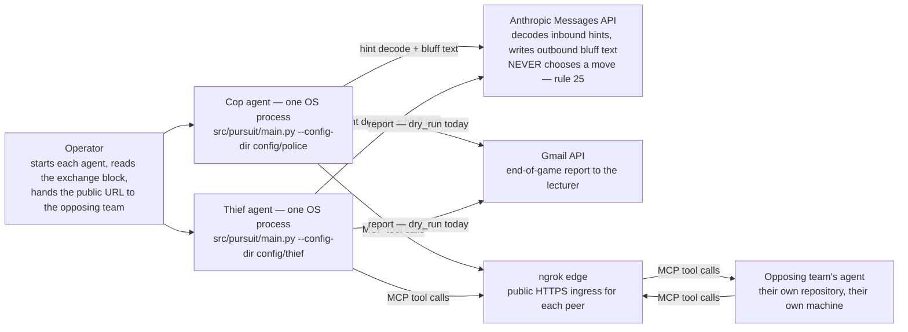
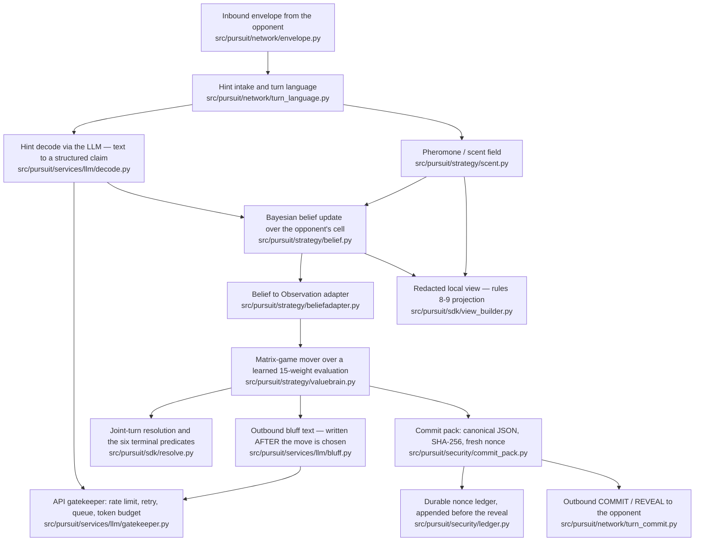
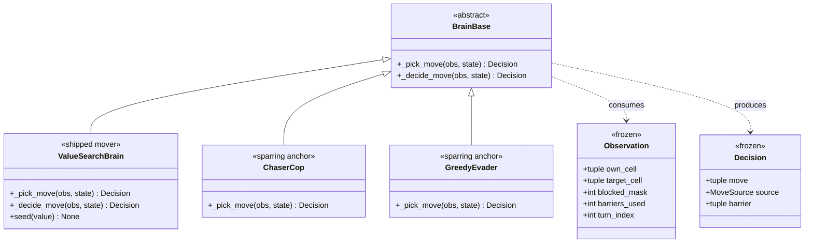
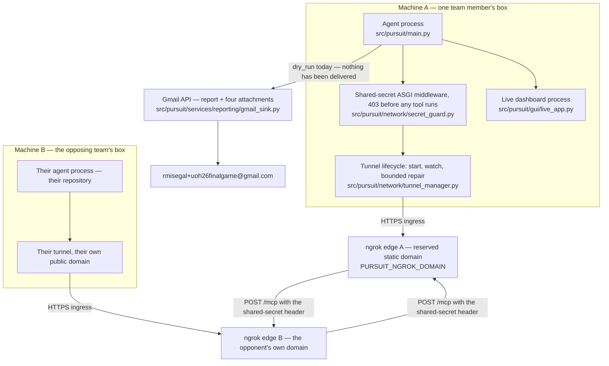
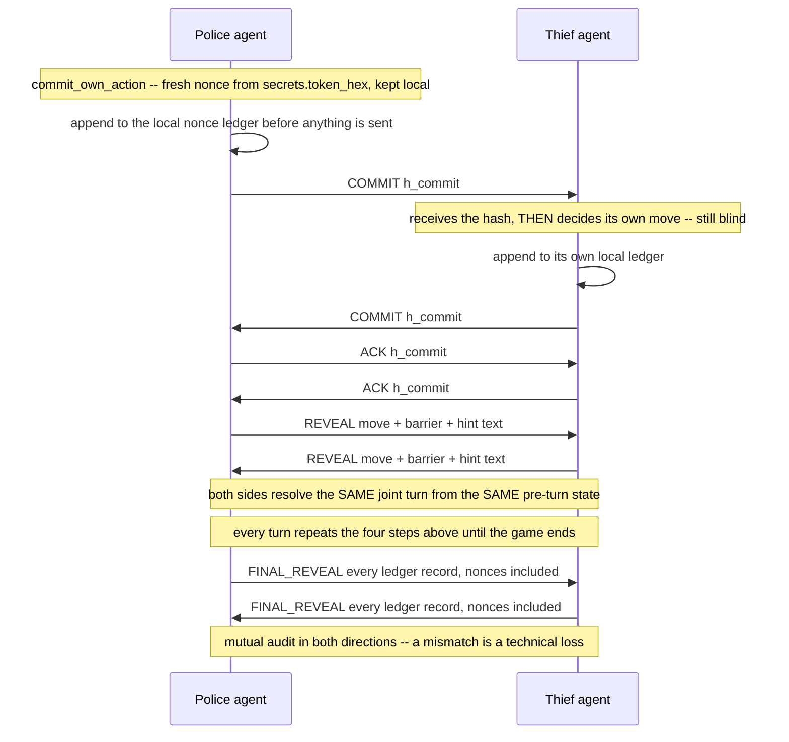

# Architecture — C4 views, deployment, and the commit-reveal exchange

**Version:** 1.00 · **Status:** approved · **Updated:** 2026-08-17 · **Plan:** 08-07
**Covers:** §17 group 1 "architecture documentation with clear diagrams" and group 6
"deployment instructions" · **Related:** [PLAN.md](PLAN.md) (text design),
[QUALITY-25010.md](QUALITY-25010.md), [EXTENSION-POINTS.md](EXTENSION-POINTS.md)

> **Every diagram below is checked, not drawn from memory.**
> `uv run python scripts/check_diagrams.py` parses each block, refuses an unknown
> diagram kind or an unbalanced delimiter, and resolves every module label under `src/pursuit`
> against `git ls-files`. `tests/unit/test_architecture_contract.py` additionally reads
> the container diagram **as a graph** and asserts the three facts CLAUDE.md makes
> binding: symmetric peers, no shared runtime state, and the GUI as a separate process.
> A diagram that stopped being true fails the suite.
>
> This exists because documents in this repository have drifted before. The root README
> described a Q-learning agent that was withdrawn and never shipped (fixed in 08-06); it
> documented *training/plot_curves.py*, deleted in `f3d9847` (unbackticked here on
> purpose: in these documents a backticked path is a claim that the path exists **now**,
> and `tests/unit/test_architecture_contract.py` holds every one of them to it). Prose is not tested. These
> diagrams are.

---

## 1. Level 1 — System context

Two agent processes, no server between them and **no referee** (D-01). Everything outside
the dashed boundary is a third party this project does not control.

<!-- diagram: c4-context -->


**Read the two Gmail edges as designed, not as exercised.** Every `reporting.json` this
repository ships carries `"mode": "dry_run"`, which writes the report to disk and
transmits nothing. **No message has ever been delivered.** The live send is 07-10's human
checkpoint and is still open; `docs/phases/phase-7/GATE-7-MEASUREMENT.md` records
criterion 1 as `dry_run` PASS + live **PENDING**.

**Rule 25 is a property of the drawing, not a caption.** The LLM node has no edge into
any decision path. `scripts/check_no_llm_in_strategy.py` enforces the same thing on the code — it AST-walks
`src/pursuit/strategy/` and fails on any import that could reach a language model,
and both agents' move choices come from `src/pursuit/strategy/valuebrain.py`.

---

## 2. Level 2 — Containers: two symmetric peers that share nothing

This is the diagram most likely to depict a disqualification, so it is the one the suite
reads back as a graph.

```mermaid
flowchart TB
    subgraph POLICE["Police process — config/police/ — its own PID"]
        pol_srv["MCP server: nine @mcp.tool handlers<br/>src/pursuit/network/tools.py"]
        pol_cli["MCP client + uvicorn runtime<br/>src/pursuit/network/peer_runtime.py"]
        pol_orc["Turn loop and state machine<br/>src/pursuit/network/orchestrator.py"]
        pol_ctx["This process's own state<br/>src/pursuit/network/agent_context.py"]
        pol_wdg["Freeze watchdog, 60 s<br/>src/pursuit/network/watchdog.py"]
        pol_sdk["SDK facade — all game logic<br/>src/pursuit/sdk/engine.py"]
        pol_brn["Brain, built from config<br/>src/pursuit/strategy/registry.py"]
        pol_gk["API gatekeeper<br/>src/pursuit/services/llm/gatekeeper.py"]
        pol_sec["Commit-reveal<br/>src/pursuit/security/commit_pack.py"]
        pol_pub["Snapshot publisher<br/>src/pursuit/sdk/view_publish.py"]
        pol_eog["End-of-game artifacts and report<br/>src/pursuit/services/reporting/end_of_game.py"]
    end
    subgraph THIEF["Thief process — config/thief/ — its own PID"]
        thf_srv["MCP server: nine @mcp.tool handlers<br/>src/pursuit/network/tools.py"]
        thf_cli["MCP client + uvicorn runtime<br/>src/pursuit/network/peer_runtime.py"]
        thf_orc["Turn loop and state machine<br/>src/pursuit/network/orchestrator.py"]
        thf_ctx["This process's own state<br/>src/pursuit/network/agent_context.py"]
        thf_wdg["Freeze watchdog, 60 s<br/>src/pursuit/network/watchdog.py"]
        thf_sdk["SDK facade — all game logic<br/>src/pursuit/sdk/engine.py"]
        thf_brn["Brain, built from config<br/>src/pursuit/strategy/registry.py"]
        thf_gk["API gatekeeper<br/>src/pursuit/services/llm/gatekeeper.py"]
        thf_sec["Commit-reveal<br/>src/pursuit/security/commit_pack.py"]
        thf_pub["Snapshot publisher<br/>src/pursuit/sdk/view_publish.py"]
        thf_eog["End-of-game artifacts and report<br/>src/pursuit/services/reporting/end_of_game.py"]
    end
    pol_snap["Published view snapshot — police seat<br/>one file, written by one process, read by one process"]
    thf_snap["Published view snapshot — thief seat<br/>one file, written by one process, read by one process"]
    gui["Live dashboard — a THIRD process, one per seat<br/>src/pursuit/gui/live_app.py"]
    replay["Replay viewer — a fourth process, offline<br/>src/pursuit/gui/replay_app.py"]
    llm["Anthropic Messages API"]
    mail["Gmail API — dry_run in every shipped config"]
    artifacts["game_artifacts — log, result, declaration, config JSON"]
    pol_cli -->|"COMMIT / ACK / REVEAL / FINAL_REVEAL"| thf_srv
    thf_cli -->|"COMMIT / ACK / REVEAL / FINAL_REVEAL"| pol_srv
    pol_srv --> pol_orc
    pol_orc --> pol_ctx
    pol_orc --> pol_sdk
    pol_orc --> pol_brn
    pol_orc --> pol_sec
    pol_orc --> pol_pub
    pol_orc --> pol_wdg
    pol_orc --> pol_eog
    pol_brn --> pol_gk
    thf_srv --> thf_orc
    thf_orc --> thf_ctx
    thf_orc --> thf_sdk
    thf_orc --> thf_brn
    thf_orc --> thf_sec
    thf_orc --> thf_pub
    thf_orc --> thf_wdg
    thf_orc --> thf_eog
    thf_brn --> thf_gk
    pol_pub --> pol_snap
    thf_pub --> thf_snap
    pol_snap --> gui
    thf_snap --> gui
    pol_gk --> llm
    thf_gk --> llm
    pol_eog --> artifacts
    thf_eog --> artifacts
    pol_eog --> mail
    thf_eog --> mail
    artifacts --> replay
```

<!-- diagram: c4-container -->


### 2.1 What the graph is asserting, and where each assertion is checked

| Claim | How the drawing carries it | Test |
|---|---|---|
| **Symmetric peers, no strong side** | the two subgraphs name an *identical* module set, and an edge crosses in **each** direction | `test_the_two_agents_are_drawn_as_symmetric_separate_peers` |
| **Each peer is server *and* client** | both subgraphs contain `tools.py` (its `@mcp.tool` handlers) **and** `peer_runtime.py` (its outbound client) | `test_each_peer_is_drawn_as_both_a_server_and_a_client` |
| **No shared runtime state (rule 2)** | **no node id is declared inside both subgraphs** — each peer holds its own `AgentContext` | `test_no_referee_or_shared_state_node_is_drawn_between_the_peers` |
| **The GUI is a separate process (D-76)** | the `gui` node belongs to neither subgraph, and neither subgraph names `gui/live_app.py` | `test_the_live_gui_is_drawn_outside_both_agent_processes` |

There is **no referee container and no shared state store** in this diagram, and adding
one would fail the third row. `peer_runtime.py`'s own docstring records the constraint the
drawing obeys: *"Each agent constructs exactly one `PeerRuntime` per process (NET-02): its
own `FastMCP` server, its own `asyncio.Queue`, zero module-level state."*

The two snapshot files are **not** shared state either. Each process writes only its own
view to its own path and never reads the other side's — `src/pursuit/sdk/view_publish.py`
states exactly that, and the rules 8–9 redaction that makes a snapshot safe to render at
all lives in `src/pursuit/sdk/view_builder.py` and `src/pursuit/strategy/display_belief.py`.

---

## 3. Level 3 — Components inside one agent: the decision pipeline

One turn, one seat. The pipeline is
`hint decode → belief update → policy move choice → bluff text → commit pack`, and the
ordering is load-bearing: the algorithm has already chosen the move before any text is
generated.

<!-- diagram: c4-component -->


**Every external call passes the gatekeeper.** Both LLM edges (`decode` and `bluff`) enter
`gatekeeper.py`; nothing reaches a provider around it. The gatekeeper's limits come from
`config/police/language.json` and `config/police/reporting.json`, never from a literal —
the mail path runs a **second instance** of the same class rather than a second
implementation.

**The bluff edge leaves `brain`, it does not enter it.** That is rule 25 drawn: the
algorithm decides, and the language model only writes about the decision afterwards.

---

## 4. Level 4 — Code: the one seam the rest of the system knows about

`src/pursuit/strategy/base.py` is the abstract seam; `src/pursuit/strategy/registry.py` is
the only place a brain is constructed. Three brains are registered today, and the diagram
is generated from what the registry actually holds — `test_the_extension_points_document_names_the_registered_brains`
re-derives the same three names from the source.

<!-- diagram: c4-code -->


`Decision.source` carries provenance as a **data field, never an inference** —
`equilibrium | exploration | heuristic | fallback`. `Decision.barrier` is `None` for the
thief by construction (D-12).

**A withdrawn class is absent on purpose.** The run-1 tabular `QLearningBrain` and its
`HeuristicBrain` partner were superseded, not merely replaced —
`docs/PRD_rl_strategy.md` carries a DO-NOT-IMPLEMENT banner pointing at
`docs/PRD_matrix_mover.md`, and `src/pursuit/strategy/registry.py`'s docstring records
that simultaneous play made Q-learning unsound here. Drawing it would document a system
this repository does not ship.

---

## 5. Deployment — two machines, two tunnels, one report path

<!-- diagram: deployment -->


Both peers are reachable **through their own tunnel**; neither dials the other's loopback.
`config/police/tunnel.json` carries names only — a provider, a header name, and the names
of three environment variables — never a value (D-55, rules 39–40).

### 5.1 Deployment instructions

**Local, two processes on one box** — the development and CI path, no tunnel:

```bash
uv sync
uv run python -m pursuit.main --config-dir config/police --check-config   # config preflight
uv run python scripts/dev_launch.py                                       # spawns both roles
```

**League day, two machines across the internet** — machine A, holding the reserved domain:

```bash
export NGROK_AUTHTOKEN=...            # never committed; .env is gitignored
export PURSUIT_NGROK_DOMAIN=<your-reserved-domain>
export PURSUIT_TUNNEL_SECRET=<agreed with the opposing team, out of band>
uv run python -m pursuit.main --config-dir config/police
```

The process prints an **exchange block** on startup — the public URL, the shared-secret
header *name*, and which environment variable the opponent must set for its *value*. It
never prints the secret. The opposing operator points their own `PURSUIT_OPPONENT_URL` at
that URL plus `/mcp` and starts their own agent. The full operator procedure, including
what to retain as evidence, is
[`docs/phases/phase-5/REMOTE-ROUND-RUNBOOK.md`](phases/phase-5/REMOTE-ROUND-RUNBOOK.md);
the ngrok-unavailable fallback is
[`docs/phases/phase-5/LOCALTONET-FALLBACK.md`](phases/phase-5/LOCALTONET-FALLBACK.md).

**Dashboards** — each is its own process and is optional:

```bash
uv run python -m pursuit.gui.live_app  --snapshot <log-stem>.view.json --refresh-ms 500
uv run python -m pursuit.gui.replay_app --artifact game_artifacts/police/log_<id>.json --step-ms 400
```

`--refresh-ms` and `--step-ms` are **required with no default**: no document in this
project states a UI refresh interval, so the operator states it and the repository states
none (OQ-6).

**What has actually been run this way:** two complete games over the tunnel between two
machines on two networks, 2026-08-16, both recording `capture` and
`audit_verdict matched=true` on a shared game UID — `docs/phases/phase-5/GATE-5-MEASUREMENT.md`,
attempt 4. **No league game against another team has been played.**

---

## 6. The commit-reveal exchange — four phases

Police is the fixed first mover (book §6.4). The reveal happens only once **both** sides
have locked their commitments, and the nonce stays local until game end.

<!-- diagram: commit-reveal -->


**Why the nonce is drawn where it is.** Rule 18 and SEC-04 keep it secret until game end;
the wire-mirroring JSONL never carries the string `"nonce"` before `FINAL_REVEAL`.
`test_the_commit_reveal_sequence_never_shows_the_nonce_before_final_reveal` refuses any
line mentioning a nonce earlier unless that line says it stays local.

The hash covers canonical JSON `{state, move, intent, nonce}` with
`sort_keys=True, separators=(",", ":")`, and the audit joins the peer's claimed records to
**this side's own observed turn numbers**, never to the turn the peer stamped. Both are
specified, with the attack each closes, in [`PRD_commit_reveal.md`](PRD_commit_reveal.md)
§2.3 and §2.6.1.

---

## 7. What this document does not claim

Stated plainly, because a diagram that overstates is worse than one that is missing.

- **Nothing has ever been mailed.** Every shipped `reporting.json` reads `dry_run`; the
  live send is 07-10's open human checkpoint.
- **No league game has been played** against another team, and the games-played **value**
  is deliberately unset pending the repository owner (rule 38, absolute).
- **Phase 4 is `human_needed`**, and **phases 7 and 8 have no verification pass** — the
  §5 tunnel evidence is Phase 5's, which is verified.
- `check_diagrams.py` is a **structural** checker. It proves a block's fence closes, its
  kind is one mermaid knows, its delimiters balance and its labels resolve. **It does not
  execute mermaid.** Rendering was verified separately and once, out of tree, with
  `@mermaid-js/mermaid-cli` 11.16.0: all six blocks produced real SVGs (22 931 – 57 123
  bytes) and none contained a `Syntax error` box, while the same two mutations the unit
  tests use — an unknown kind and an unbalanced bracket — were **rejected by the real
  renderer**. That run is recorded in `08-07-SUMMARY.md`; it is not wired into CI, because
  mermaid-cli needs a headless Chromium and this project's suite is offline by rule.
  If a diagram is edited, re-run it.
